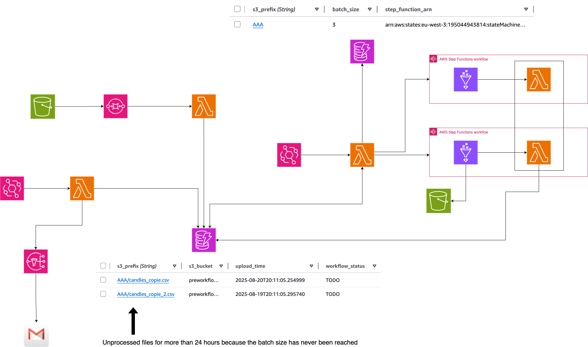

## Part 3 – Alert and Monitoring for stuck files

#### NOTE : THIS README WAS WRITTEN MANUALLY WITHOUT THE USE OF ANY GEN AI TOOL. PLEASE TAKE THE TIME TO READ IT, AS I PUT EFFORT INTO WRITING IT RATHER THAN JUST TELLING CHATGPT TO DO IT FOR ME 🙂 .

**Note:** Make sure to check out the [Version 1 repository](https://github.com/hamzabel99/Data_Ingestion_V1) and the [Version 2 repository](https://github.com/hamzabel99/Data_Ingestion_V2) first, as it’s essential to understand the foundation before diving into Version 2.

In the last version, the workflows were launched if and only if enough files were upload and ready for being processed in batch. 
This can be problematic if we got, for example 3 files and the minimal batch size is 4 and no more file is uploaded for a while. Thus, 3 files wouldn't be processed and we would never know about them.

For the 3rd version, I added a monitoring tool that tracks any files stuck in the workflow for an extended period. At the end of each day, a Lambda scans the Workflow_status table, identifies files still in "TODO" status past a configurable threshold (e.g., 48 hours), and sends an alert email via SNS. This allows timely alerts for potential bottlenecks without manually checking the pipeline neither the S3 buckets.

